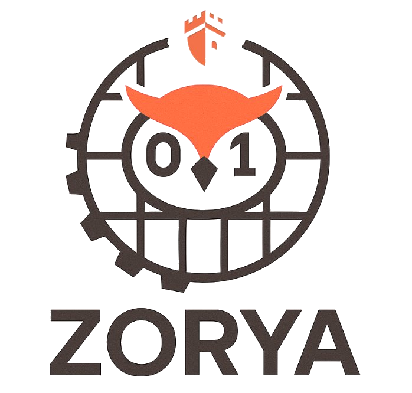
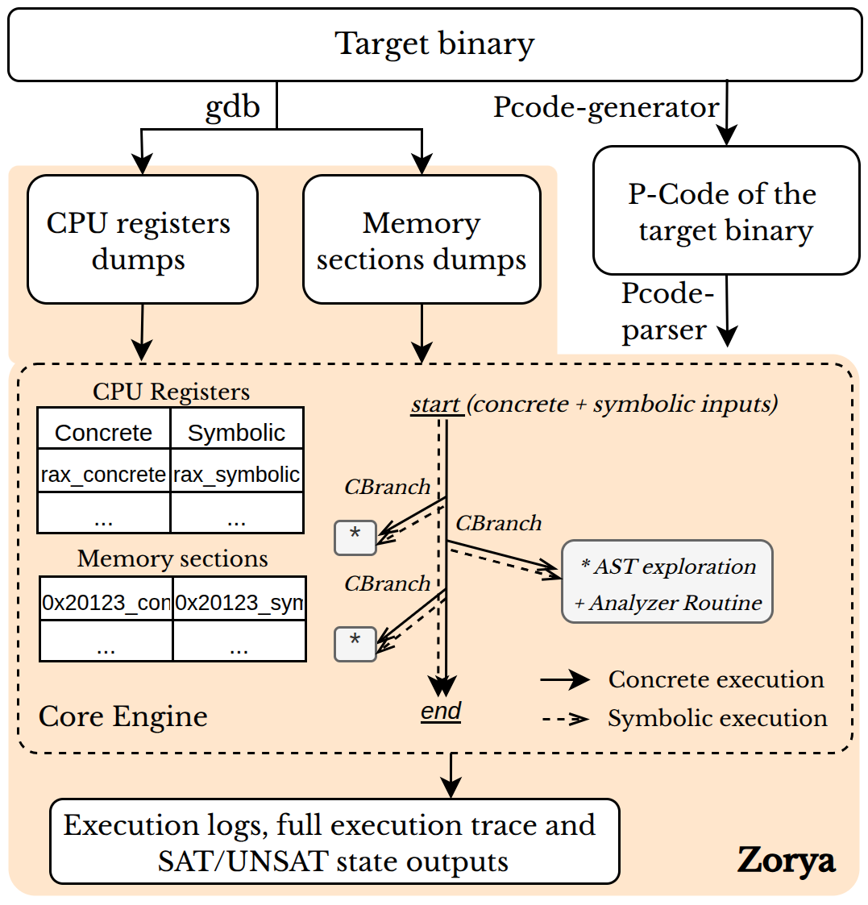

<!--
SPDX-FileCopyrightText: 2025 Ledger https://www.ledger.com - INSTITUT MINES TELECOM

SPDX-License-Identifier: Apache-2.0
-->

<div align="center">
  
</div>

<br>

<p align="center">
  <a href="LICENSE"></a>
  
  <a href="https://www.rust-lang.org/"></a>
</p>

Zorya is a concolic execution framework for binary-level vulnerability analysis, with a strong focus on Go binaries.
It initializes execution from real runtime state (CPU + memory dumps), translates code to Ghidra low-level P-Code, and executes paths with concrete and symbolic values using Z3 SMT solver.

The engine is written in Rust and includes a state manager, AMD64 CPU model, memory model, and virtual file system.
It supports language/compiler-aware exploration strategies, including targeted advanced mode and fuzzer-driven campaigns.

> The owl sees what darkness keeps —
> Zorya comes, and nothing sleeps.

🚧 Zorya is under active development. Breaking changes may happen. 🚧

## 1. Install

### Option A: Docker Installation

```bash
git clone --recursive https://github.com/Ledger-Donjon/zorya
cd zorya
docker build -t zorya:latest .

docker run -it --rm \
  --security-opt seccomp=unconfined \
  --cap-add=SYS_PTRACE \
  -v $(pwd)/results:/opt/zorya/results \
  zorya:latest
```

### Option B: Native Installation

```bash
git clone --recursive https://github.com/Ledger-Donjon/zorya
cd zorya
make ghidra-config
make all
```

## 2. Usage

### A. Interactive usage

Run:

```bash
zorya <absolute-path-to-binary>
```

Interactive mode asks for:
- language and compiler
- execution mode (`start`, `main`, `function`, `advanced`)
- optional function/address details
- optional binary arguments
- optional negated-path exploration
- plugin selection

> **Note:** Program arguments (e.g. `os.Args` for Go, `argv` for C/C++) are
> automatically made symbolic by default. The `--symbolic-registers` and
> `--symbolic-memory` flags are only needed in `advanced` mode when you want
> fine-grained control over additional symbolic inputs.

Detailed interactive and flag behavior: [doc/Usage.md](doc/Usage.md)

### B. Basic command-line usage

```bash
zorya <path> --lang <go|c|c++> [--compiler <tinygo|gc>] \
  --mode <start|main|function|advanced> <addr> \
  --thread-scheduling <all-threads|main-only> \
  [--arg "<arg1> <arg2>"] \
  [--negate-path-exploration|--no-negate-path-exploration] \
  [--plugin "<plugin1 plugin2>"|all|none] \
  [--force-pty] \
  [--symbolic-registers "REG1 REG2|all"] \
  [--symbolic-memory "0xADDR:SIZE ..."] \
  [--no-symbolic-registers] [--no-symbolic-memory]
```

Full flag reference and examples: [doc/Usage.md](doc/Usage.md)

Running from macOS/Rosetta? Use the documented Linux runner workflow:
[doc/Usage.md#linux-runner-workflow-manual-for-macosrosetta-users](doc/Usage.md#linux-runner-workflow-manual-for-macosrosetta-users)
and optional helper script `scripts/zorya-remote-run.sh`.

### C. MCP Server (LLM agent interface)

Zorya ships a [Model Context Protocol](https://modelcontextprotocol.io/) server (`zorya-mcp`) that lets an LLM agent in **Cursor**, **Claude Code**, or **GitHub Copilot** drive the full analysis pipeline autonomously.

```bash
cargo build --release
```

Full tool reference, workflow diagram, configuration for all supported clients, and usage examples: [src/mcp/README.md](src/mcp/README.md)

### D. Fuzzer mode

For automated campaigns on multiple addresses/configurations:

```bash
cargo build --release --bin zorya-fuzzer
./target/release/zorya-fuzzer --create-example fuzzer_config.json
./target/release/zorya-fuzzer fuzzer_config.json
```

Full documentation: [doc/Fuzzer.md](doc/Fuzzer.md)

### How to build your binary?

Zorya works best with debug symbols.

For Go:
- `tinygo build -gc=conservative -opt=0 .`
- `go build -gcflags=all="-N -l" .`

More details: [doc/Go-Binary-Analysis.md](doc/Go-Binary-Analysis.md)

## 3. Quick start with test binaries

You can validate your setup with the included test programs in `tests/programs`.

Minimal quick start:

```bash
zorya /absolute/path/to/zorya/tests/programs/crashme/crashme
```

Expected outputs and result files are documented in:
[doc/Quickstart.md](doc/Quickstart.md)

### Example: TOCTOU detection with input solving

Zorya detects Time-of-Check-Time-of-Use vulnerabilities through overlay concolic execution. When a vulnerability is gated behind a specific input, Zorya uses Z3 to solve the triggering condition and reports it in source-level terms:

```
zorya tests/programs/toctou-test2-with-input/toctou-test2-with-input \
  --lang go --compiler gc --mode main \
  --thread-scheduling all-threads --arg "a" \
  --negate-path-exploration --plugin "toctou chancheck"
```

Output in `results/plugin_findings.txt`:

```
[toctou::overlay-check-reachable] Potential TOCTOU: SO_PEERCRED(fd=<runtime-assigned>)
    reachable on input-gated path (use not reached in overlay)
    Triggering input (Z3-solved): os.Args[1][0] = 0x02 (decimal 2)
```

This tells you that providing a first argument whose first byte is `2` reaches the `getsockopt(SO_PEERCRED)` → `readlinkat(/proc/<pid>/exe)` race window. The finding includes an attack narrative, reproduction steps, and mitigations.

## 4. Documentation

<p align="center">
  
</p>


Technical details were moved under `doc/`:

- Usage and CLI details: [doc/Usage.md](doc/Usage.md)
- Quick start and expected outputs: [doc/Quickstart.md](doc/Quickstart.md)
- Vulnerability detection: [doc/Vulnerability-Detection.md](doc/Vulnerability-Detection.md)
- Compiler-aware strategies: [doc/Compiler-Aware-Strategies.md](doc/Compiler-Aware-Strategies.md)
- Overlay path analysis: [doc/Overlay-Path-Analysis.md](doc/Overlay-Path-Analysis.md)
- Analyzer routine: [doc/AST-exploration-overlay-execution.png](doc/AST-exploration-overlay-execution.png)
- Strategy overview: [doc/Strategies.md](doc/Strategies.md)
- Multi-threading: [doc/Multi-threading.md](doc/Multi-threading.md)
- Go binary analysis details: [doc/Go-Binary-Analysis.md](doc/Go-Binary-Analysis.md)
- Fuzzer reference: [doc/Fuzzer.md](doc/Fuzzer.md)

## 5. Demo videos

Demo on broken-calculator binary compiled with TinyGo:
[Demo](https://youtu.be/8PeSZFvr6WA)

Pass the SALT 2026 presentation:
[Presentation](https://passthesalt.ubicast.tv/videos/2026-automated-vulnerability-detection-in-go-concolic-execution-for-multi-threaded-binaries)

## 6. Academic work

June 2026 - From TinyGo to gc Compiler: Extending Zorya's Concolic Framework to Real-World Go Binaries (ACM EASE 2026):
[ArXiv](https://arxiv.org/abs/2605.03492)

```bibtex
@article{gorna2026tinygo,
  title={From TinyGo to gc Compiler: Extending Zorya's Concolic Framework to Real-World Go Binaries},
  author={Gorna, Karolina and Iooss, Nicolas and Seurin, Yannick and Khatoun, Rida and Makan, Keith},
  journal={arXiv preprint arXiv:2605.03492},
  year={2026},
  note={Accepted at the 30th ACM International Conference on Evaluation and Assessment in Software Engineering (EASE 2026)}
}
```

March 2026 - Zorya: Automated Concolic Execution of Single-Threaded Go Binaries (ACM SAC 2026):
[ACM Digital Library](https://dl.acm.org/doi/pdf/10.1145/3748522.3779940)

```bibtex
@inproceedings{gorna2026zorya,
  title={Zorya: Automated Concolic Execution of Single-Threaded Go Binaries},
  author={Gorna, Karolina and Iooss, Nicolas and Seurin, Yannick and Khatoun, Rida},
  booktitle={Proceedings of the 41st ACM/SIGAPP Symposium on Applied Computing},
  pages={2037--2044},
  year={2026}
}
```

May 2025 - Exposing Go's Hidden Bugs: A Novel Concolic Framework (IEEE SERA 2025):
[IEEE Xplore](https://ieeexplore.ieee.org/document/11449147)

```bibtex
@INPROCEEDINGS{11449147,
  author={Gorna, Karolina and Iooss, Nicolas and Seurin, Yannick and Khatoun, Rida},
  booktitle={2025 IEEE/ACIS 23rd International Conference on Software Engineering Research, Management and Applications (SERA)},
  title={Exposing Go’s Hidden Bugs: A Novel Concolic Framework},
  year={2025},
  pages={1-6},
  keywords={Couplings;Concurrent computing;Computer languages;Runtime;Static analysis;Fuzzing;Explosions;Security;Protection;Testing;Concolic execution;Go;Invariant testing;Vulnerabilities detection;P-Code},
  doi={10.1109/SERA65747.2025.11449147}
}
```

Evaluation repository:
[Zorya Evaluation](https://github.com/Ledger-Donjon/zorya-evaluation)

Evaluation Go dataset:
[Logic-Bombs-Go](https://github.com/Ledger-Donjon/logic_bombs_go)

## 7. Findings

Bugs discovered with Zorya on real-world open-source projects. Last update: June, 23rd 2026.

| Repository | Bug / Vuln type | Report | Status |
|---|---|---|---|
| **OOB / Slice bounds** | | | |
| [mandiant/gopacket](https://github.com/mandiant/gopacket) | OOB slice | [#23](https://github.com/mandiant/gopacket/issues/23) | Fixed |
| [mandiant/gopacket](https://github.com/mandiant/gopacket) | OOB slice | [#25](https://github.com/mandiant/gopacket/issues/25) | Fixed |
| [0xPolygon/bor](https://github.com/0xPolygon/bor) | OOB slice | [#2221](https://github.com/0xPolygon/bor/issues/2221) | Fixed |
| [seaweedfs/seaweedfs](https://github.com/seaweedfs/seaweedfs) | OOB slice | [PR #9712](https://github.com/seaweedfs/seaweedfs/pull/9712) | Fixed |
| [seaweedfs/seaweedfs](https://github.com/seaweedfs/seaweedfs) | Index OOB | [PR #9713](https://github.com/seaweedfs/seaweedfs/pull/9713) | Fixed |
| [zeromicro/go-zero](https://github.com/zeromicro/go-zero) | OOB slice | [#5614](https://github.com/zeromicro/go-zero/issues/5614) | Fixed |
| [multiformats/go-multiaddr](https://github.com/multiformats/go-multiaddr) | OOB slice | [PR #289](https://github.com/multiformats/go-multiaddr/pull/289) | Fixed |
| [pion/dtls](https://github.com/pion/dtls) | Index OOB | [GHSA-wg4g-wm44-ch5j](https://github.com/pion/dtls/security/advisories/GHSA-wg4g-wm44-ch5j) / CVE-2026-54908 | Fixed (medium) |
| [pion/stun](https://github.com/pion/stun) | OOB slice | [GHSA-34rh-wp3j-6cxc](https://github.com/pion/stun/security/advisories/GHSA-34rh-wp3j-6cxc) / CVE-2026-54909 | Fixed (medium) |
| [zeromicro/go-zero](https://github.com/zeromicro/go-zero) | OOB slice | [#5607](https://github.com/zeromicro/go-zero/issues/5607) | Fixed |
| [multiformats/go-multiaddr](https://github.com/multiformats/go-multiaddr) | OOB slice | [#288](https://github.com/multiformats/go-multiaddr/issues/288) | Fix ongoing |
| **Integer overflow** | | | |
| [gochain/gochain](https://github.com/gochain/gochain) | Integer overflow | [GHSA-rmvq-87f6-4pfc](https://github.com/gochain/gochain/security/advisories/GHSA-rmvq-87f6-4pfc) | Fixed |
| [erpc/erpc](https://github.com/erpc/erpc) | Integer overflow | [#869](https://github.com/erpc/erpc/issues/869) | Reported |
| [trufnetwork/kwil-db](https://github.com/trufnetwork/kwil-db) | Integer overflow | [#1701](https://github.com/trufnetwork/kwil-db/issues/1701) | Reported |
| [cometbft/cometbft](https://github.com/cometbft/cometbft) | Integer overflow | [#5846](https://github.com/cometbft/cometbft/issues/5846) | Fixed |
| [gnolang/gno](https://github.com/gnolang/gno) | Integer overflow | [#5639](https://github.com/gnolang/gno/issues/5639) | Fix ongoing |
| [XinFinOrg/XDPoSChain](https://github.com/XinFinOrg/XDPoSChain) | Integer underflow | [#2362](https://github.com/XinFinOrg/XDPoSChain/issues/2362) | Fixed |
| [kedacore/keda](https://github.com/kedacore/keda) | Float-to-int overflow | [#7796](https://github.com/kedacore/keda/issues/7796) | Fix ongoing |
| [multiversx/mx-chain-go](https://github.com/multiversx/mx-chain-go) | Float-to-int64 overflow | Private disclosure | Reported |
| [LeJamon/go-xrpl](https://github.com/LeJamon/go-xrpl) | Int64 wrap (MPT amount) | [GHSA-xv89-94jf-8vx2](https://github.com/LeJamon/go-xrpl/security/advisories/GHSA-xv89-94jf-8vx2) / CVE-2026-61693 | Fix ongoing |
| [LeJamon/go-xrpl](https://github.com/LeJamon/go-xrpl) | Uint64 mul overflow (MPT amount) | [GHSA-j5cw-qr86-mmv7](https://github.com/LeJamon/go-xrpl/security/advisories/GHSA-j5cw-qr86-mmv7) / CVE-2026-61694 | Fixed |
| **Nil pointer dereference** | | | |
| [runatlantis/atlantis](https://github.com/runatlantis/atlantis) | Nil pointer dereference | [#6492](https://github.com/runatlantis/atlantis/issues/6492) | Fixed |
| [crossplane-contrib/provider-http](https://github.com/crossplane-contrib/provider-http) | Nil pointer dereference | [#178](https://github.com/crossplane-contrib/provider-http/issues/178) | Fix ongoing |
| [kedacore/keda](https://github.com/kedacore/keda) | Nil pointer dereference | [#7798](https://github.com/kedacore/keda/issues/7798) | Fixed |