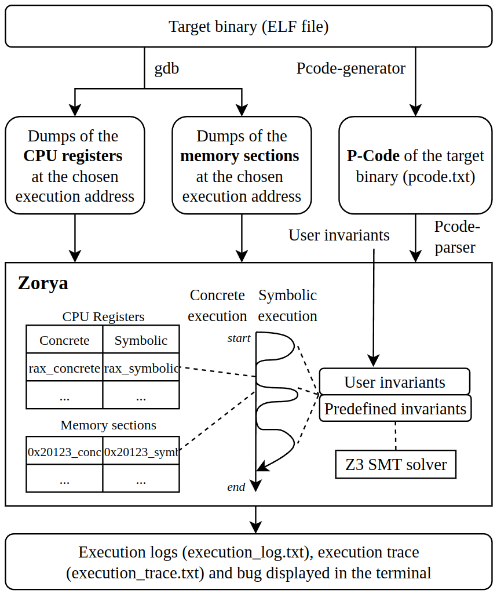

<!--
SPDX-FileCopyrightText: 2025 Ledger https://www.ledger.com - INSTITUT MINES TELECOM

SPDX-License-Identifier: Apache-2.0
-->

<div align="center">
  
</div>

<br>

<p align="center">
  <a href="LICENSE"></a>
  
  <a href="https://www.rust-lang.org/"></a>
</p>

Zorya is a concolic execution framework for binary-level vulnerability analysis, with a strong focus on Go binaries.
It initializes execution from real runtime state (CPU + memory dumps), translates code to Ghidra low-level P-Code, and executes paths with concrete and symbolic values using Z3 SMT solver.

The engine is written in Rust and includes a state manager, AMD64 CPU model, memory model, and virtual file system.
It supports language/compiler-aware exploration strategies, including targeted advanced mode and fuzzer-driven campaigns.

> The owl sees what darkness keeps —
> Zorya comes, and nothing sleeps.

🚧 Zorya is under active development. Breaking changes may happen. 🚧

## 1. Install

### Option A: Docker Installation

```bash
git clone --recursive https://github.com/Ledger-Donjon/zorya
cd zorya
docker build -t zorya:latest .

docker run -it --rm \
  --security-opt seccomp=unconfined \
  --cap-add=SYS_PTRACE \
  -v $(pwd)/results:/opt/zorya/results \
  zorya:latest
```

### Option B: Native Installation

```bash
git clone --recursive https://github.com/Ledger-Donjon/zorya
cd zorya
make ghidra-config
make all
```

## 2. Usage

### A. Interactive usage

Run:

```bash
zorya <absolute-path-to-binary>
```

Interactive mode asks for:
- language and compiler
- execution mode (`start`, `main`, `function`, `advanced`)
- optional function/address details
- optional binary arguments
- optional negated-path exploration

Advanced mode allows explicit symbolic register and memory selection.

Detailed interactive and flag behavior: [doc/Usage.md](doc/Usage.md)

### B. Basic command-line usage

```bash
zorya <path> --lang <go|c|c++> [--compiler <tinygo|gc>] \
  --mode <start|main|function|advanced> <addr> \
  [--thread-scheduling <all-threads|main-only>] \
  [--arg "<arg1> <arg2>"] \
  [--negate-path-exploration|--no-negate-path-exploration] \
  [--force-pty] \
  [--symbolic-registers "REG1 REG2|all"] \
  [--symbolic-memory "0xADDR:SIZE ..."] \
  [--no-symbolic-registers] [--no-symbolic-memory]
```

Full flag reference and examples: [doc/Usage.md](doc/Usage.md)

### C. Fuzzer mode

For automated campaigns on multiple addresses/configurations:

```bash
cargo build --release --bin zorya-fuzzer
./target/release/zorya-fuzzer --create-example fuzzer_config.json
./target/release/zorya-fuzzer fuzzer_config.json
```

Full documentation: [doc/Fuzzer.md](doc/Fuzzer.md)

### How to build your binary?

Zorya works best with debug symbols.

For Go:
- `tinygo build -gc=conservative -opt=0 .`
- `go build -gcflags=all="-N -l" .`

More details: [doc/Go-Binary-Analysis.md](doc/Go-Binary-Analysis.md)

## 3. Quick start with test binaries

You can validate your setup with the included test programs in `tests/programs`.

Minimal quick start:

```bash
zorya /absolute/path/to/zorya/tests/programs/crashme/crashme
```

Expected outputs and result files are documented in:
[doc/Quickstart.md](doc/Quickstart.md)

## 4. Documentation

<p align="center">
  
</p>


Technical details were moved under `doc/`:

- Usage and CLI details: [doc/Usage.md](doc/Usage.md)
- Quick start and expected outputs: [doc/Quickstart.md](doc/Quickstart.md)
- Vulnerability detection: [doc/Vulnerability-Detection.md](doc/Vulnerability-Detection.md)
- Compiler-aware strategies: [doc/Compiler-Aware-Strategies.md](doc/Compiler-Aware-Strategies.md)
- Overlay path analysis: [doc/Overlay-Path-Analysis.md](doc/Overlay-Path-Analysis.md)
- Strategy overview: [doc/Strategies.md](doc/Strategies.md)
- Multi-threading: [doc/Multi-threading.md](doc/Multi-threading.md)
- Go binary analysis details: [doc/Go-Binary-Analysis.md](doc/Go-Binary-Analysis.md)
- Fuzzer reference: [doc/Fuzzer.md](doc/Fuzzer.md)

## 5. Demo videos

Demo on TinyGo broken-calculator:
[Demo](https://youtu.be/8PeSZFvr6WA)

EthCC 2025 overview presentation:
[Presentation](https://www.youtube.com/live/QpcAtfN3B9M)

## 6. Roadmap

Roadmap is available in:
[doc/roadmap-zorya_october-2025.png](doc/roadmap-zorya_october-2025.png)

## 7. Academic work

Exposing Go's Hidden Bugs: A Novel Concolic Framework (IEEE SERA 2025):
[IEEE Xplore](https://ieeexplore.ieee.org/document/11449147)

```bibtex
@INPROCEEDINGS{11449147,
  author={Gorna, Karolina and Iooss, Nicolas and Seurin, Yannick and Khatoun, Rida},
  booktitle={2025 IEEE/ACIS 23rd International Conference on Software Engineering Research, Management and Applications (SERA)},
  title={Exposing Go’s Hidden Bugs: A Novel Concolic Framework},
  year={2025},
  pages={1-6},
  keywords={Couplings;Concurrent computing;Computer languages;Runtime;Static analysis;Fuzzing;Explosions;Security;Protection;Testing;Concolic execution;Go;Invariant testing;Vulnerabilities detection;P-Code},
  doi={10.1109/SERA65747.2025.11449147}
}
```

Zorya: Automated Concolic Execution of Single-Threaded Go Binaries:
[ArXiv](https://arxiv.org/abs/2512.10799)

```bibtex
@article{gorna2025zorya,
  title={Zorya: Automated Concolic Execution of Single-Threaded Go Binaries},
  author={Gorna, Karolina and Iooss, Nicolas and Seurin, Yannick and Khatoun, Rida},
  journal={arXiv preprint arXiv:2512.10799},
  year={2025},
  note={Accepted at the 41st ACM/SIGAPP Symposium On Applied Computing (SAC 2026)}
}
```

Evaluation repository:
[Zorya Evaluation](https://github.com/Ledger-Donjon/zorya-evaluation)

Evaluation Go dataset:
[Logic-Bombs-Go](https://github.com/Ledger-Donjon/logic_bombs_go)