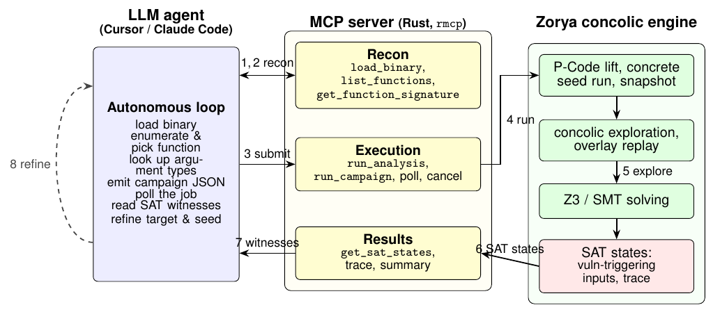

# Zorya MCP Server

The Zorya MCP server (`zorya-mcp`) exposes the concolic execution engine as a set of tools that an LLM agent can call directly inside **Cursor**, **Claude Code**, or **GitHub Copilot**. Instead of running shell commands manually, you describe what you want to find and the agent drives the full analysis — loading the binary, picking functions, running campaigns, and surfacing vulnerability-triggering inputs.

<p align="center">
  
</p>

The agent works through three phases:

- **Recon** — load the binary, list functions, resolve argument types.
- **Execution** — submit a concolic campaign, poll for completion.
- **Results** — read SAT witnesses (concrete inputs that trigger a bug), inspect the execution trace.

---

## Prerequisites

Before using the MCP server, make sure the full Zorya toolchain is installed and working on your machine. The MCP server is a thin wrapper around the same pipeline used by the CLI — it won't work without the underlying engine.

**If you haven't installed Zorya yet**, follow one of these options from the repo root:

```bash
# Option A — Docker (recommended, no native dependencies)
docker build -t zorya:latest .

# Option B — Native
make ghidra-config && make all
```

Verify your installation by running a quick test:

```bash
zorya tests/programs/crashme/crashme
```

Once Zorya runs correctly, proceed below.

---

## Step 1 — Build the MCP server

From the zorya workspace root, build **all** release binaries at once. The MCP server needs both `zorya-mcp` (the server itself) and `zorya-fuzzer` (used internally by `run_campaign`):

```bash
cargo build --release
```

This places the binaries at:
- `target/release/zorya-mcp` — the MCP server
- `target/release/zorya-fuzzer` — the campaign runner (called internally, do not invoke directly)

> If you only build `--bin zorya-mcp`, `run_campaign` will fail at runtime with a `zorya-fuzzer binary not found` error.

---

## Step 2 — Configure your client

Pick the section that matches your editor. Replace `/absolute/path/to/zorya` with the actual path to the cloned repository on your machine.

### Cursor

Create or edit `.cursor/mcp.json` at your **project root** (or `~/.cursor/mcp.json` for a global installation):

```json
{
  "mcpServers": {
    "zorya": {
      "command": "/absolute/path/to/zorya/target/release/zorya-mcp",
      "env": {
        "ZORYA_DIR": "/absolute/path/to/zorya"
      }
    }
  }
}
```

Restart Cursor. Go to **Settings → MCP** to confirm the `zorya` server appears with a green status indicator.

### Claude Code

Register the server once from the terminal:

```bash
claude mcp add zorya /absolute/path/to/zorya/target/release/zorya-mcp \
  --env ZORYA_DIR=/absolute/path/to/zorya
```

Verify it was added:

```bash
claude mcp list
```

The `zorya` server will be available in every Claude Code session on that machine from now on.

### GitHub Copilot (VS Code)

Create `.vscode/mcp.json` at your **workspace root**:

```json
{
  "servers": {
    "zorya": {
      "type": "stdio",
      "command": "/absolute/path/to/zorya/target/release/zorya-mcp",
      "env": {
        "ZORYA_DIR": "/absolute/path/to/zorya"
      }
    }
  }
}
```

Also make sure MCP is enabled in your VS Code user settings:

```json
{
  "chat.mcp.enabled": true
}
```

Reload VS Code. Copilot Chat will discover the `zorya` tools automatically.

### About ZORYA_DIR

`ZORYA_DIR` tells the server where the zorya workspace root is (the directory that contains `Cargo.toml`). If you omit it, the server tries to auto-detect the location by walking up from its own binary path — this usually works when the binary lives inside the repo (`target/release/zorya-mcp`), but setting it explicitly is safer and avoids ambiguity.

---

## Step 3 — Run your first analysis

Once the server is connected, open a chat session in your editor and give the agent a target binary. A minimal prompt to get started:

> "Load `/absolute/path/to/mybinary`, list the functions in the `main` package, pick the most interesting ones for concolic analysis, run a campaign, and tell me if any SAT states were found."

The agent will call the tools in the correct order. You can also drive it step by step as described below.

### Workflow walkthrough

The numbered steps match the arrows in the diagram above.

#### 1. Load the binary

```
load_binary(
  binary_path = "/absolute/path/to/mybinary",
  language    = "go",          # go | c | c++
  compiler    = "gc",          # gc | tinygo (Go)  /  gcc | clang (C/C++)
  thread_scheduling = "main-only"   # optional, Go gc only
)
```

The server parses the ELF, extracts the entry point and section list, and **stores `binary_path`, `language`, `compiler`, and `thread_scheduling` in session state**. Every subsequent tool call reuses these values — you do not need to repeat them.

> Build your binary with debug symbols for best results:
> - Go: `go build -gcflags=all="-N -l" .`
> - TinyGo: `tinygo build -gc=conservative -opt=0 .`

#### 2. List functions

```
list_functions(filter="main.", limit=50)
```

Returns a paginated table of function names, addresses, and sizes sorted by address. Use `filter` to narrow to a package or prefix, and `offset`/`limit` to page through large symbol tables.

#### 3. Resolve argument types

```
get_function_signature(name_or_address="main.processInput")
# or by address:
get_function_signature(name_or_address="0x4bec40")
```

The server looks up the function in `results/function_signatures_go.json` (produced by a previous Zorya run), then falls back to Ghidra signatures, then to the raw ELF symbol table. The result tells the agent what argument types to pass in the campaign.

> Detailed argument types are only available when the binary has been analysed at least once before (the signature file is generated during pcode extraction). On a first run, the ELF fallback still returns the function address and size.

#### 4. Submit a campaign

`run_campaign` takes only a `tests` list. The global config (language, compiler, binary path, thread scheduling, negate-path) is taken automatically from the session state set by `load_binary`.

```
run_campaign(tests=[
  {
    "id":            "main.processInput-sweep",
    "mode":          "function",   # start | main | function
    "start_address": "0x4bec40",
    "args":          "5",          # space-separated concrete seeds, or "none"
    "timeout_seconds": 120
  }
])
```

Returns a `job_id` (integer). The analysis runs in the background; the call returns immediately. The campaign config is written to `mcp_campaign_config.json` in the workspace root for inspection.

For a **single function** without running a full campaign, use `run_analysis` instead:

```
run_analysis(
  mode          = "function",
  start_address = "0x4bec40",
  args          = "5",
  negate_path   = true
)
```

#### 5. Poll for completion

```
get_job_status(job_id=42)
```

Returns:
- `state`: `running` | `completed` | `failed`
- `elapsed_seconds`: time since submission
- `exit_code`: process exit code (once finished)
- `sat_found`: `true` if a `FOUND_SAT_STATE.txt` file was written (completed jobs only)

Poll every ~10 seconds until `state` is no longer `running`.

#### 6. Read findings

For a **campaign**, use the test `id` you set in step 4:

```
get_sat_states(test_id="main.processInput-sweep")
```

For a **single `run_analysis`** run, omit `test_id` to read from the default `results/` directory:

```
get_sat_states()
```

Returns the raw content of `FOUND_SAT_STATE.txt` — concrete input values that triggered a vulnerability (OOB index, integer overflow, nil dereference, panic, etc.).

To see a summary across all tests in a campaign:

```
get_campaign_summary()
```

Reads `fuzzer_results/fuzzer_summary.txt` and returns a pass/fail/timeout/SAT table for every test.

#### 7. Inspect the trace (optional)

```
get_execution_trace(test_id="main.processInput-sweep", limit=100)
# or for a single run:
get_execution_trace(limit=100)
```

Returns a paginated function call trace with argument values, useful for understanding the execution path that led to the bug. Use `offset` + `limit` to page through large traces.

#### 8. Iterate

Based on findings, the agent refines the target list, adjusts arguments, or increases timeouts and submits a new campaign. Use `cancel_job(job_id=42)` to kill a stuck job. Use `list_result_files(test_id="main.processInput-sweep")` to enumerate all artifact files for a test.

---

## Tool reference

| Group | Tool | Parameters | Description |
|-------|------|------------|-------------|
| Recon | `load_binary` | `binary_path`, `language`, `compiler`?, `thread_scheduling`? | Parse an ELF binary and store language/compiler in session state. Must be called first. |
| Recon | `list_functions` | `filter`?, `offset`?, `limit`? | Paginated function listing from the ELF symbol table. |
| Recon | `get_function_signature` | `name_or_address` | Resolve a function's argument types from signatures JSON, Ghidra, or ELF fallback. |
| Recon | `list_strings` | `filter`?, `min_length`?, `offset`?, `limit`? | List printable strings from the binary (requires `strings` on PATH). |
| Execution | `run_analysis` | `mode`, `start_address`, `args`?, `negate_path`? | Run concolic analysis on a single function. Returns `job_id`. |
| Execution | `run_campaign` | `tests` | Run a multi-test campaign via `zorya-fuzzer`. Returns `job_id`. |
| Execution | `get_job_status` | `job_id` | Poll a job: `state`, `elapsed_seconds`, `sat_found`, `exit_code`. |
| Execution | `cancel_job` | `job_id` | Kill a running job by ID. |
| Results | `get_sat_states` | `test_id`? | Read `FOUND_SAT_STATE.txt` for a campaign test or the latest single run. |
| Results | `get_execution_trace` | `test_id`?, `offset`?, `limit`? | Read the function call trace (paginated). |
| Results | `get_campaign_summary` | _(none)_ | Read `fuzzer_results/fuzzer_summary.txt` — pass/fail/SAT table for all tests. |
| Results | `list_result_files` | `test_id`? | List artifact files for a test or the main `results/` directory. |

---

## Source files

| File | Role |
|------|------|
| `main.rs` | Binary entry point, `ZORYA_DIR` detection, stdio server startup |
| `server.rs` | `ZoryaMcp` struct with all tool implementations (`rmcp` `#[tool]` macros) |
| `types.rs` | Parameter types with JSON Schema descriptions for LLM tool discovery |
| `jobs.rs` | Async job manager tracking spawned child processes |
